# Data Agent 智能问数与经营分析平台

面向业务人员的 Data Agent：用自然语言完成智能问数与经营分析。统一入口经意图路由与一次性规划（Planner）调度 Text-to-SQL / 日志诊断，结合 MCP、LLM 与 SSE 流式交互，输出可解释结论与执行轨迹。

**在线访问**：[https://ai-gateway-production-74c4.up.railway.app](https://ai-gateway-production-74c4.up.railway.app)

> Railway 为试用额度，**请勿开保活 ping**；平时可在控制台暂停服务，面试前再启动。额度用完或暂停后请用本页截图 + 本地运行演示。

**技术栈**：FastAPI · LangChain · MCP SDK · Vue 3 · Element Plus · ECharts · MySQL

---

## 界面演示（全功能）

侧边栏四个入口：**数据概览 → 分析中心 → SQL 工作台 → 日志诊断**。

### 1. 数据概览（控制台）

首页统计分析任务 / 查询记录 / 诊断报告 / 数据集，并提供「新建分析」「日志诊断」「SQL 工作台」快捷入口。

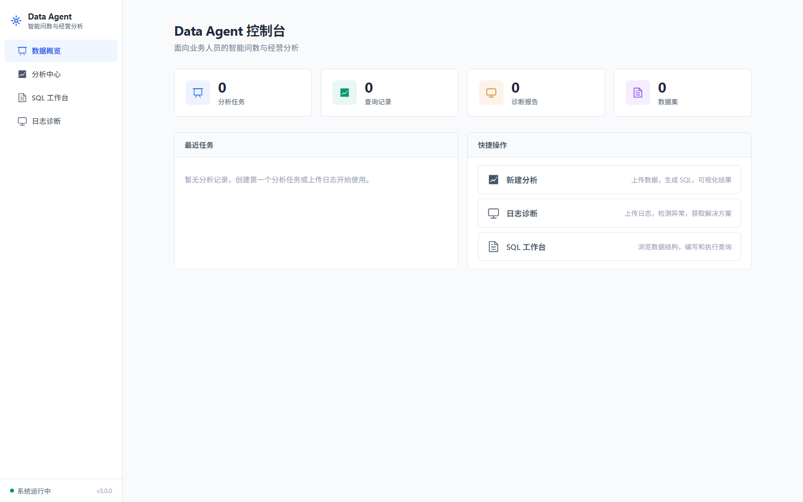

### 2. 分析中心（空状态）

会话列表 + 主工作区。新建会话后可选择「数据分析」或「日志诊断」。

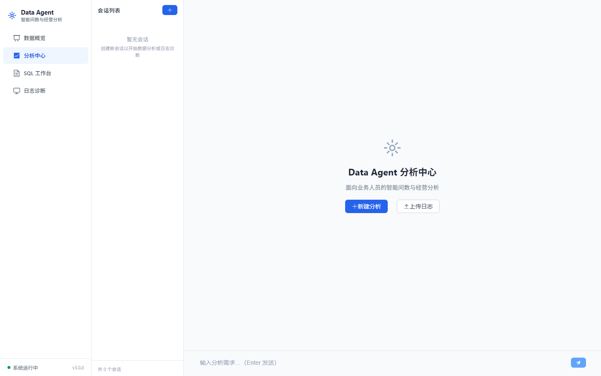

### 3. 新建会话：上传数据或内置 SEO 数据集

数据分析模式支持上传 Excel / CSV，或一键加载**内置 SEO 演示数据集**（多站点 × 约 60 天流量 + 关键词排名），无需自备文件即可演示经营问数。

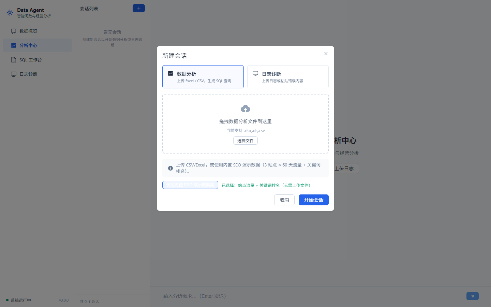

### 4. 主 Demo：自然语言问数「最近30天SEO流量为什么下降？」

完整链路：提问 → Router / Planner 多步规划 → 生成 SQL → 数据表 / 图表 → **核心结论**（含部分失败步骤的诚实说明）。

**4.1 输入问题**


**4.2 分析流程（执行轨迹）**

SSE 流式展示意图路由、一次性规划、工具步骤与耗时。

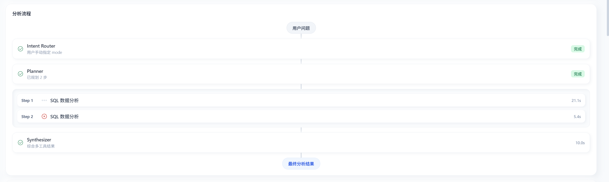

**4.3 生成 SQL**

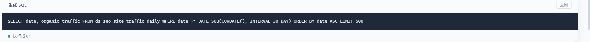

**4.4 数据表结果**

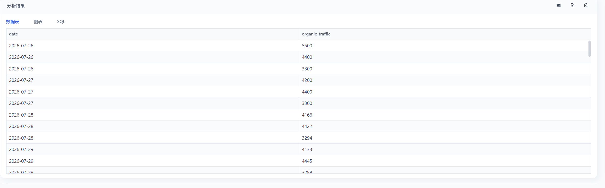

**4.5 图表可视化**

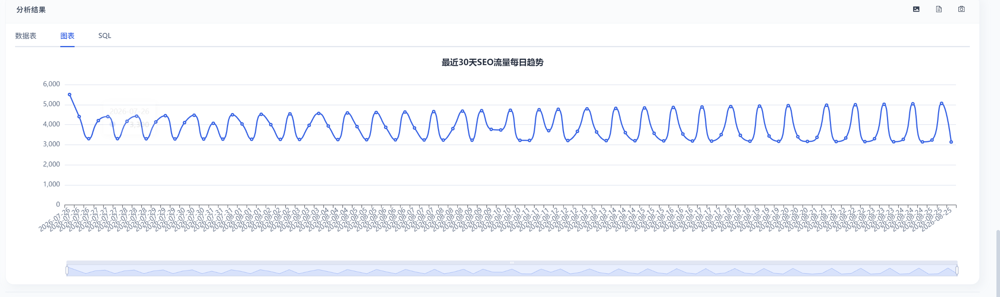

**4.6 核心结论（经营解读）**

结论卡片置于表/图上方，综合多步结果给出业务判断，并对缺字段等失败步骤给出边界说明。

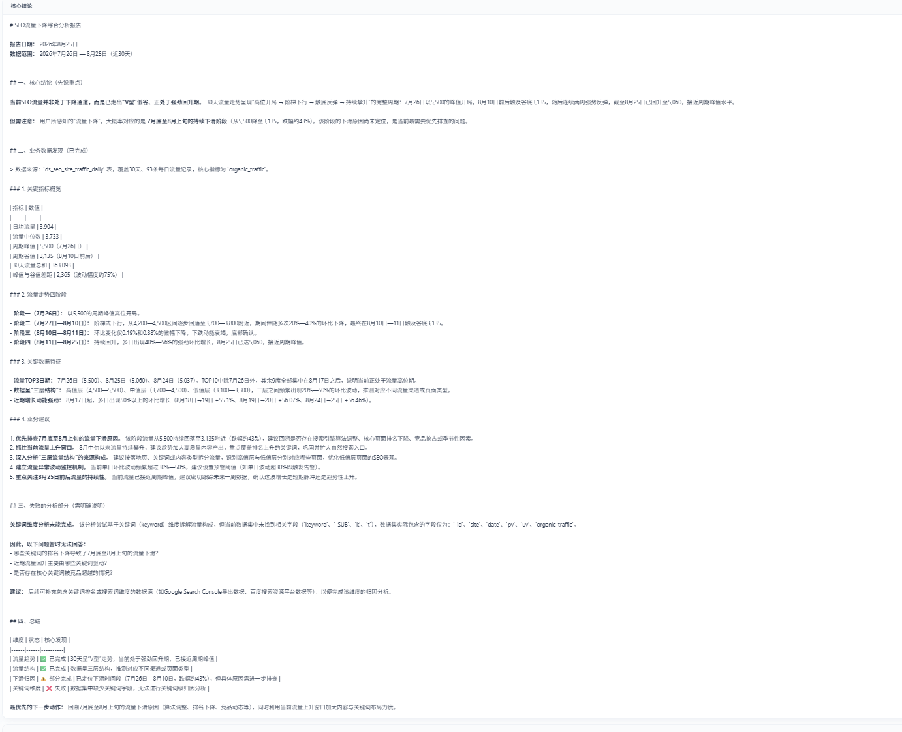

### 5. SQL 工作台

独立 SQL 编辑器：编写 / 格式化 / 复制 / 执行查询，结果区支持表格与导出。适合已熟悉表结构时的直接探查（自然语言问数仍推荐走「分析中心」）。


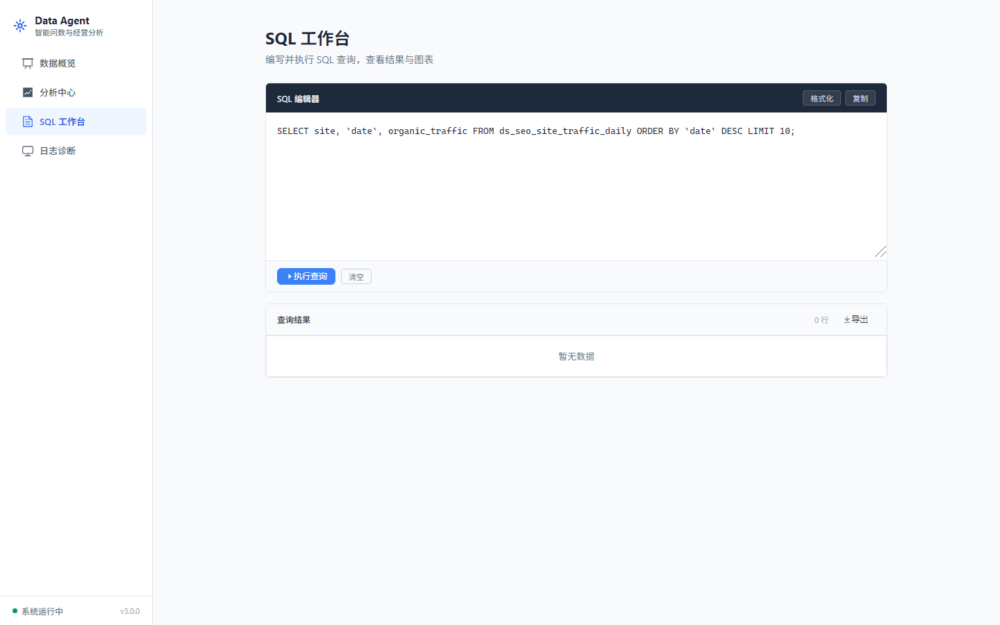

### 6. 日志诊断

上传 `.log` / `.txt` / `.out`，或直接粘贴错误日志；自动输出风险等级、严重度、异常类型、根因、关键证据与排查建议（LLM 结构化诊断）。

**6.1 粘贴日志并开始诊断**

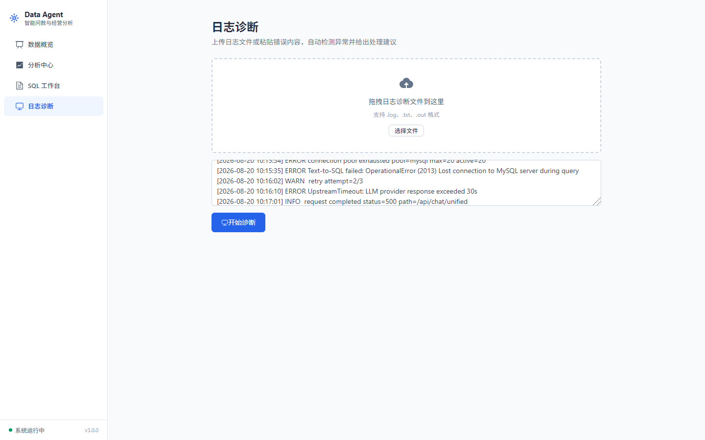

**6.2 诊断报告**

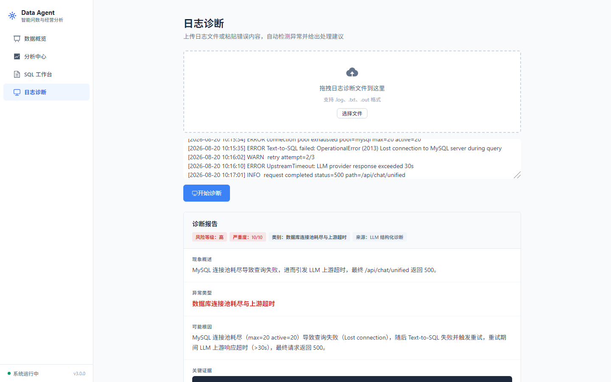

### 7. 应用壳层（品牌与导航）

全局侧栏品牌 **Data Agent / 智能问数与经营分析**，四模块导航与系统状态。


截图索引见 [`docs/screenshots/README.md`](docs/screenshots/README.md)。

---

## 功能实现说明

| 功能 | 怎么用 | 实现要点 |
|------|--------|----------|
| 数据概览 | 首页查看统计与快捷入口 | `DashboardView` + Pinia 会话统计 |
| 分析中心问数 | 新建会话 → 上传 CSV/Excel 或内置 SEO → 自然语言提问 | Text-to-SQL + SSE Pipeline；结果 Tab：表 / 图 / SQL；可导出 |
| 执行轨迹 | 分析过程中右侧/流程区查看 | Router → Planner(≤3 步) → Tool →（多工具）Synthesizer |
| SQL 工作台 | 直接编写并执行 SQL | `SQLWorkspaceView` 经统一 chat 入口执行 |
| 日志诊断 | 上传或粘贴日志 → 开始诊断 | 解析 / 脱敏 / 严重度 / 根因报告；支持追问 |
| 内置 SEO 数据 | 新建会话勾选内置数据集 | 种子表 `ds_seo_site_traffic_daily` 等，滚动约 60 天 |

---

## 核心链路（统一编排）

```
用户问题
   ↓
统一入口 /api/chat/stream
   ↓
Intent Router（意图初判）
   ↓
One-shot Planner（一次性规划，≤3 步）
   ↓
Tool Registry ── SQL Tool / Log Tool（MCP 可选辅助）
   ↓
Tool Observations
   ↓
单工具 → 直接返回 ；多工具 → LLM Synthesizer 综合
   ↓
Execution Trace + SSE 流式响应
   ↓
Vue 分析控制台
```

### 技术特性

- **统一 SSE 入口** `POST /api/chat/stream`：事件含 `routing / plan / stage / sql / tool_done / delta / trace / result / error`
- **一次性 Planner（非 ReAct）**：最多 3 步；解析失败 fallback 到 Router 单工具，不无限循环
- **Tool Registry 解耦**：业务层只认工具名，执行层复用既有 SQL / Log pipeline
- **两层容错**：SQL 逻辑错由底层自愈（≤3 次）；编排层仅对基础设施失败重试（≤2 次）；多工具允许部分成功
- **可观测 Trace**：前端时间线展示每步工具状态与耗时

### 能力边界（刻意约束）

| 已有能力 | 本次编排层 | 明确不做 |
|---|---|---|
| Text-to-SQL / SQL 自愈 | Unified SSE + Router + Planner | Multi-Agent / ReAct Loop |
| 日志诊断 / 脱敏评分 | Tool Registry + Synthesizer | 无限 Planner / Model Router |
| MCP Client / Vue 控制台 | 轻量 Trace | Token Billing / 完整 OTel |

> 定位为「多工具统一智能分析平台」，而非模型网关（LiteLLM 类）。

---

## 目录结构

```
ai-gateway/
├── backend/                     FastAPI 后端
│   ├── app/
│   │   ├── main.py              统一 /api/chat 与 /api/chat/stream、MCP 暴露
│   │   ├── core/                编排：orchestrator / planner / synthesizer / trace / tools
│   │   ├── services/sql/        SQL 生成、校验、重试、SEO 种子数据
│   │   └── services/log/        日志解析、脱敏、诊断报告
│   ├── demo/                    示例日志与数据
│   └── .env.example
└── frontend/                    Vue 3 前端
    ├── src/views/               数据概览 / 分析中心 / SQL 工作台 / 日志诊断
    ├── src/components/          AppLayout、ExecutionTrace、NewSessionDialog
    └── vite.config.js           开发代理 /api → http://127.0.0.1:8000
```

---

## 本地运行

### 环境要求

- Python 3.10+
- Node.js 18+
- MySQL 8.0（SQL 问数需要；纯日志诊断可不配库）

### 后端

```bash
cd backend
python -m venv venv

# Windows
venv\Scripts\activate
# macOS / Linux
source venv/bin/activate

pip install -r requirements.txt
cp .env.example .env    # 填入 API Key 与 MySQL（如需）
uvicorn app.main:app --reload --port 8000
```

API 文档：`http://127.0.0.1:8000/docs`

### 前端

```bash
cd frontend
npm install
npm run dev
```

前端：`http://localhost:3000`。开发代理将 `/api` 转到 `http://127.0.0.1:8000`（见 `vite.config.js`）。

### 环境变量（`backend/.env`）

| 变量 | 说明 | 必填 |
|---|---|---|
| `OPENAI_API_KEY` | DeepSeek 或 OpenAI 兼容 Key | 是 |
| `OPENAI_BASE_URL` | 默认 `https://api.deepseek.com/v1` | 是 |
| `OPENAI_MODEL` | 默认 `deepseek-chat` | 是 |
| `MYSQL_*` | 数据库连接（SQL 模式） | 否 |
| `MYSQL_SSL_ENABLED` | 托管库强制 TLS 时设 `true` | 否 |
| `CORS_ORIGINS` | 允许的前端来源 | 是 |
| `LLM_FALLBACK_MOCK` | LLM 不可用时规则模板回退 | 否 |

---

## 部署

单服务 Docker：多阶段构建前端进 `static/`，由 FastAPI 同源托管（利于 SSE）。

```bash
docker build -t ai-gateway .
docker run -p 7860:7860 -e OPENAI_API_KEY=sk-xxx ai-gateway
```

SQL 模式可用 [TiDB Cloud](https://tidbcloud.com/) 等免费 MySQL 兼容库，并设置 `MYSQL_SSL_ENABLED=true`。

---

## 评测与失败案例

产品迭代中保留了部分已知失败（如校验器误伤 SQL 函数、跨表关键词、拒答边界），详见：

- [`eval/evaluation_results.md`](eval/evaluation_results.md)
- [`eval/metrics_summary.md`](eval/metrics_summary.md)
- [`docs/failure_cases.md`](docs/failure_cases.md)

---

## 许可证

MIT License
